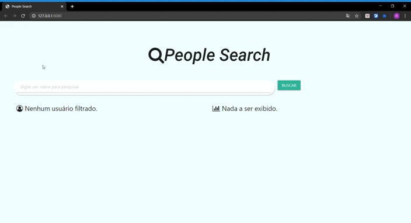

# People-Search
---
 Projeto que tem a finalidade de procurar pessoas em uma base de dados e mostrar: 
 * A Foto da Pessoa;
 * Nome Completo;

 Além das Estatisticas: 
 * Genero;
 * Idade;
 * Média de Idade;
---
# Linguagem, Frameworks e Ferramentas Utilizadas
---
* HTML;
* CSS;
* JavaScript;
* Font-Awesome;
* Materialize;

Para utilizar o Font-Awesome, basta fazer o download da pasta com os icones, e indicar o caminho onde está o arquivo: **font-awesome.min.css**.

---
# Demonstração
---
